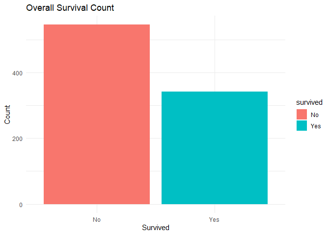
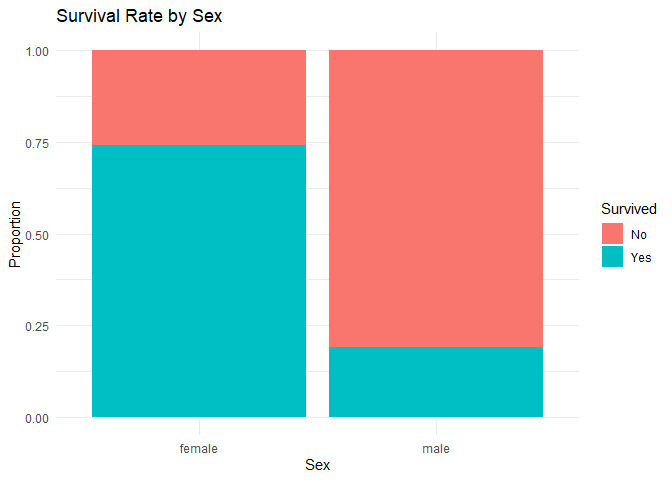

Analyzing Titanic Tragedy
================
Nazmil Ashraf

## Historical Background

On April 15, 1912, the RMS Titanic sank in the North Atlantic Ocean
after striking an iceberg during her maiden voyage from Southampton to
New York City. Of the estimated 2,224 passengers and crew aboard, more
than 1,500 died, making it one of the deadliest maritime disasters in
modern history.

The tragedy led to major improvements in maritime safety regulations and
highlighted significant social inequalities of the early 20th century,
as passenger survival rates varied dramatically by social class and
gender.

## The Data

We’re going to look at passenger records from the titanic. This dataset
includes includes:

- Survival status (1 = Survived, 0 = Did not survive)
- Passenger Class (1st, 2nd, or 3rd class)
- Sex (Male/Female)
- Age
- Number of Siblings (of the passenger) Aboard
- Number of Parents (of the passenger) Aboard
- Fare paid

Start by downloading the dataset and getting acquainted with it.

``` r
# Download data
download.file("https://stanford.io/2O9RUCF", 
              destfile = "titanic_temp.csv", 
              mode = "wb")

titanic <- read.csv("titanic_temp.csv")
```

### Part 1: Data Exploration

1.  Create appropriate visualizations showing:
    - Overall survival rate
    - Survival rates by passenger class
    - Survival rates by sex
    - Survival rates by age groups
2.  What factors seem to have the strongest relationship with survival?
3.  Were these patterns what you expected given the historical context?

``` r
# Convert survived to factor with labels
titanic <- titanic %>% 
  mutate(
    survived = factor(Survived, levels= c(0,1), labels= c("No","Yes")),
    
  )

# Define Age Groups (Children., Young Adults, Adults, Elderly)

titanic <- titanic %>% 
  mutate(Age_group = cut(Age, 
                         breaks = c(0,18,30,55,Inf),
                         labels= c("Child (0-18)", "Young Adult (19-30)", "Adult (31-55)", "Elderly (56+)"),
                         right = FALSE))

# Plotting
# 1. Overall survival rate
ggplot(titanic, aes(x = survived, fill =  survived))+
  geom_bar()+
  labs(title = "Overall Survival Count", x= "Survived", y =  "Count")+
  theme_minimal()
```

<!-- -->

``` r
#2. Survival rates by passenger class
ggplot(titanic, aes(x = Pclass, fill = survived)) +
  geom_bar(position = "fill") + # 'position="fill"' shows proportions
  labs(title = "Survival Rate by Passenger Class", x = "Passenger Class", y = "Proportion", fill = "Survived") +
  theme_minimal()
```

<!-- -->

``` r
# 3. Survival rates by sex
ggplot(titanic, aes(x = Sex, fill = survived))+
  geom_bar(position = "fill") + # 'position="fill"' shows proportions
  labs(title = "Survival Rate by Sex", x = "Sex", y = "Proportion", fill = "Survived") +
  theme_minimal()
```

<!-- -->

``` r
# 4. Survival rates by age groups
ggplot(titanic, aes(x = Age_group, fill = survived)) +
  geom_bar(position = "fill") + # 'position="fill"' shows proportions
  labs(title = "Survival Rate by Age Group", x = "Age Group", y = "Proportion", fill = "Survived") +
  theme_minimal()
```

<!-- -->

What factors seem to have the strongest relationship with survival? Sex:
This is the a dominant factor. The proportion of females survived in the
Titanic was very higher than the proportion of males.

Passenger Class: First Class passengers had the highest survival rate
compared to the second and third classes.

Age: Children (0-18) generally show a higher survival rate.

Were these patterns what you expected given the historical context? Yes,
the patterns strongly align with historical context and the “women and
children first” protocol which can be seen in the Sex and Age visuals

### Part 2: Linear Probability Model

1.  Estimate a linear probability model predicting survival using sex,
    passenger class, and age.
2.  Interpret your coefficients.
3.  What are the limitations of using a linear probability model in this
    context?

``` r
# Estimate a linear probability model predicting survival using sex, passenger class, and age.

model <- lm(Survived ~ Sex + Pclass + Age, data = titanic)

summary(model)
```

    ## 
    ## Call:
    ## lm(formula = Survived ~ Sex + Pclass + Age, data = titanic)
    ## 
    ## Residuals:
    ##      Min       1Q   Median       3Q      Max 
    ## -1.09262 -0.23538 -0.07934  0.22379  1.00023 
    ## 
    ## Coefficients:
    ##              Estimate Std. Error t value Pr(>|t|)    
    ## (Intercept)  1.294666   0.058487  22.136  < 2e-16 ***
    ## Sexmale     -0.494826   0.027466 -18.016  < 2e-16 ***
    ## Pclass      -0.192097   0.016998 -11.301  < 2e-16 ***
    ## Age         -0.004973   0.001003  -4.959  8.5e-07 ***
    ## ---
    ## Signif. codes:  0 '***' 0.001 '**' 0.01 '*' 0.05 '.' 0.1 ' ' 1
    ## 
    ## Residual standard error: 0.3831 on 883 degrees of freedom
    ## Multiple R-squared:  0.3832, Adjusted R-squared:  0.3811 
    ## F-statistic: 182.9 on 3 and 883 DF,  p-value: < 2.2e-16

``` r
stargazer(model,
          type = "text",
          title = "Linear Probabilty Model (LPM) Results",
          dep.var.labels = "Survived (0 = No, 1 = Yes)",
          covariate.labels = c("Sex (Male)", "Passenger Class (2nd)", "Passenger Class (3rd)", "Age")
          )
```

    ## 
    ## Linear Probabilty Model (LPM) Results
    ## =================================================
    ##                           Dependent variable:    
    ##                       ---------------------------
    ##                       Survived (0 = No, 1 = Yes) 
    ## -------------------------------------------------
    ## Sex (Male)                     -0.495***         
    ##                                 (0.027)          
    ##                                                  
    ## Passenger Class (2nd)          -0.192***         
    ##                                 (0.017)          
    ##                                                  
    ## Passenger Class (3rd)          -0.005***         
    ##                                 (0.001)          
    ##                                                  
    ## Age                            1.295***          
    ##                                 (0.058)          
    ##                                                  
    ## -------------------------------------------------
    ## Observations                      887            
    ## R2                               0.383           
    ## Adjusted R2                      0.381           
    ## Residual Std. Error        0.383 (df = 883)      
    ## F Statistic            182.891*** (df = 3; 883)  
    ## =================================================
    ## Note:                 *p<0.1; **p<0.05; ***p<0.01

Sex (male) = -0.495 Being Male decreases the probability of survival by
about 50 percentage points, compared to being Female, holding class and
age constant.

Pclass2 = -0.192 Being in 2nd Class decreases the probability of
survival by about 19.2 percentage points, compared to being in 1st
Class, holding sex and age constant.

Pclass3 = -0.29 Being in 3rd Class decreases the probability of survival
by about 29 percentage points, compared to being in 1st Class, holding
sex and age constant.

Age = -0.005 Each additional one year of age decreases the probability
of survival by about 0.5 percentage points, holding sex and class
constant.

### Part 3: Logit Model

1.  Estimate a logit model using the same variables.

``` r
model_1 <- glm(Survived ~ Sex + Pclass + Age, data= titanic, family = binomial(link = "logit") )
summary(model_1)
```

    ## 
    ## Call:
    ## glm(formula = Survived ~ Sex + Pclass + Age, family = binomial(link = "logit"), 
    ##     data = titanic)
    ## 
    ## Coefficients:
    ##              Estimate Std. Error z value Pr(>|z|)    
    ## (Intercept)  4.878511   0.463474  10.526  < 2e-16 ***
    ## Sexmale     -2.589163   0.186933 -13.851  < 2e-16 ***
    ## Pclass      -1.230538   0.124957  -9.848  < 2e-16 ***
    ## Age         -0.034361   0.007134  -4.816 1.46e-06 ***
    ## ---
    ## Signif. codes:  0 '***' 0.001 '**' 0.01 '*' 0.05 '.' 0.1 ' ' 1
    ## 
    ## (Dispersion parameter for binomial family taken to be 1)
    ## 
    ##     Null deviance: 1182.77  on 886  degrees of freedom
    ## Residual deviance:  801.61  on 883  degrees of freedom
    ## AIC: 809.61
    ## 
    ## Number of Fisher Scoring iterations: 5

``` r
stargazer(model_1, 
          type = "text", 
          title = "Logit Model Results (Log-Odds)",
          dep.var.labels = "Survived (0=No, 1=Yes)",
          notes = "Coefficients are interpreted in log-odds.")
```

    ## 
    ## Logit Model Results (Log-Odds)
    ## ===========================================================
    ##                              Dependent variable:           
    ##                   -----------------------------------------
    ##                            Survived (0=No, 1=Yes)          
    ## -----------------------------------------------------------
    ## Sexmale                           -2.589***                
    ##                                    (0.187)                 
    ##                                                            
    ## Pclass                            -1.231***                
    ##                                    (0.125)                 
    ##                                                            
    ## Age                               -0.034***                
    ##                                    (0.007)                 
    ##                                                            
    ## Constant                          4.879***                 
    ##                                    (0.463)                 
    ##                                                            
    ## -----------------------------------------------------------
    ## Observations                         887                   
    ## Log Likelihood                    -400.806                 
    ## Akaike Inf. Crit.                  809.613                 
    ## ===========================================================
    ## Note:                           *p<0.1; **p<0.05; ***p<0.01
    ##                   Coefficients are interpreted in log-odds.

2.  Calculate and interpret the odds ratios.

``` r
# Exponentiate the coefficients to get the Odds Ratios (e^beta)
odds_ratios <- exp(coef(model_1))

# Format and display the Odds Ratios
odds_ratios_table <- data.frame(
  Variable = names(odds_ratios),
  Odds_Ratio = as.numeric(odds_ratios)
)

print("--- Odds Ratio Table ---")
```

    ## [1] "--- Odds Ratio Table ---"

``` r
print(odds_ratios_table)
```

    ##      Variable   Odds_Ratio
    ## 1 (Intercept) 131.43485141
    ## 2     Sexmale   0.07508286
    ## 3      Pclass   0.29213545
    ## 4         Age   0.96622221

Sex(Male) = 0.075 Interpretation: Being Male reduces the odds of
survival by a factor of approximately 0.075, compared to being female.
Stated differently, the odds of a male surviving are only 7% of the odds
of a female surviving.

Pclass = 0.292 Interpretation: Being in other Class reduces the odds of
survival by a factor of 0.292, or a 69% (1- 0.292)x100 reduction ,
compared to being in 1st Class.

Age = 0.96 Interpretation: Each additional one year of age reduces the
odds of survival by a factor of 0.96, or a 4% reduction

### Part 4: Policy Analysis

1.  Based on your models, what were the key determinants of survival on
    the Titanic?
2.  What do your results suggest about social inequality in 1912?

Based on both models, the key determinants of survival were, in order of
strength: Sex and Passenger Class.

The results implies an idea of social inequality in 1912:

The disaster protocol was supposed to be “women and children first,” but
our models show it was heavily influenced by “money first.” The wealthy
(1st Class) were located closer to the lifeboats and had better access,
giving them a huge advantage.

The steep drop in survival odds for 3rd Class passengers proves that
where you stood in the social hierarchy directly impacted your
opportunity to live or die. The tragedy was not just a disaster of
nature, but a disaster of structural inequality.
